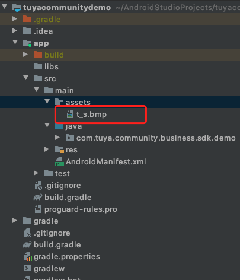
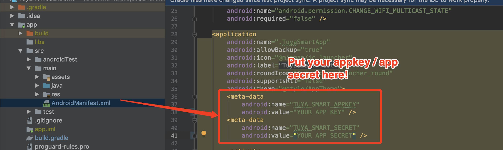

# Demo App

##  Introduction：

The Demo APP mainly demonstrates the SDK development process. Before developing the APP, it is recommended to complete the Demo App operation according to this document.

After completing the [Integration Preparation](./Preparation.md) chapter, you will obtain the `AppKey`, `AppSecret`, and security picture information used by the SDK. When integrating the SDK, please confirm whether the `AppKey`, `AppSecret`, and security image are consistent with the information on the platform. Any mismatch will cause the SDK to be unusable.

[Click to view Demo address🔗](https://github.com/tuya/tuya-community-android-sdk/tree/master/tuyacommunitydemo)

1. Replace the `applicationId` in the `build.gradle` file in the app directory with your application package name

2. Name your security picture: "t_s.bmp" and put it under the "src"-"main"-"assets" folder in the app directory

3. Fill in your AppKey and AppSecret into the corresponding <meta-data> tag in `AndroidManifest.xml`


Then click Run to run your demo:

## Functional Overview:

Demo App mainly includes

- User management: scan code login related
- House management and equipment management module: including the list and details of the house. The display of the equipment list in the house, and the control of equipment function points. Device renaming and device removal.
- Scene module: list of scenes, details, execution, etc.


## Common problem

**API interface request prompts signature error**

```json
{
  "success" : false,
  "errorCode" : "SING_VALIDATE_FALED",
  "status" : "error",
  "errorMsg" : "Permission Verification Failed",
  "t" : 1583208740059
}
```

* Please check whether your AppKey, AppSecret and security picture are correctly configured and are consistent with the ones obtained in [Integration Preparation](Preparation.md).
* Whether the safe picture is placed in the correct directory and the file name is: t_s.bmp