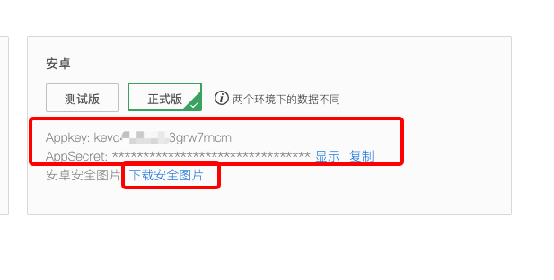

# Integrated SDK
## Create project

Create a new project in Android Studio.

## Configure build.gradle

Add the dependencies downloaded in the integration preparation to the build.gradle file.

```groovy
defaultConfig {
    ndk {
        abiFilters "armeabi-v7a", "arm64-v8a"
    }
 }
dependencies {
    implementation 'com.alibaba:fastjson:1.1.67.android'
    implementation 'com.squareup.okhttp3:okhttp-urlconnection:3.14.9'
  	
    // The latest stable version of Tuya CommunitySDK: (Previously given in aar form)
    implementation(name:'tuyacommunity-sdk-0.0.1', ext:'aar')
    
    //**** Camera tools needed to be imported when not connected to the web container *****//
    implementation 'com.tuya.smart:tuyasmart-base-utils:3.18.0r143-rc.9'
  
   
}
```

Add the jcenter() warehouse to the build.gradle file in the root directory

```groovy
repositories {
    jcenter()
}
```

>[!TIP]
>
> * Tuya community has integrated armeabi-v7a and arm64-v8a into sdk.


## Integrated safety picture

Click "Download Safe Picture" ——"Safe Picture Download" to download the safe picture.




Click "Download Security Picture" in the integration preparation. Name the downloaded security picture "t_s.bmp" and place it in the assets folder of the project directory.


## Set up Appkey and AppSecret

Configure appkey and appSecret in the AndroidManifest.xml file, configure the corresponding permissions, etc.

```xml
<meta-data
android:name="TUYA_SMART_APPKEY"
android:value="Appkey" />
<meta-data
android:name="TUYA_SMART_SECRET"
android:value="AppSecret" />

```

## Proguard

Configure in the proguard-rules.pro file

```bash
#fastJson
-keep class com.alibaba.fastjson.**{*;}
-dontwarn com.alibaba.fastjson.**

#mqtt
-keep class com.tuya.smart.mqttclient.mqttv3.** { *; }
-dontwarn com.tuya.smart.mqttclient.mqttv3.**

#OkHttp3
-keep class okhttp3.** { *; }
-keep interface okhttp3.** { *; }
-dontwarn okhttp3.**

-keep class okio.** { *; }
-dontwarn okio.**

-keep class com.tuya.**{*;}
-dontwarn com.tuya.**
```

## Initialize the SDK
**Description**

It is used to initialize the SDK. Please initialize the SDK in Application to ensure that all processes can be initialized.

**Sample Code**

```java
public class TuyaCommunityApp extends Application {
    @Override
    public void onCreate() {
        super.onCreate();
        TuyaCommunitySDK.init(this);
    }
}
```


appId and appSecret need to be configured in the AndroidManifest.xml file, and can also be initialized in the initialization code.

```java
TuyaCommunitySDK.init(Application application, String appkey, String appSerect) 
```


## Log out of Tuya Cloud Connection
When exiting the application, call the following interface to log out.

```java
TuyaCommunitySDK.onDestroy();
```

## Debug switch

In debug mode, you can turn on the log switch of the SDK to view more log information to help quickly locate the problem. It is recommended to turn off the log switch in release mode.

```java
TuyaCommunitySDK.setDebugMode(true);
```

