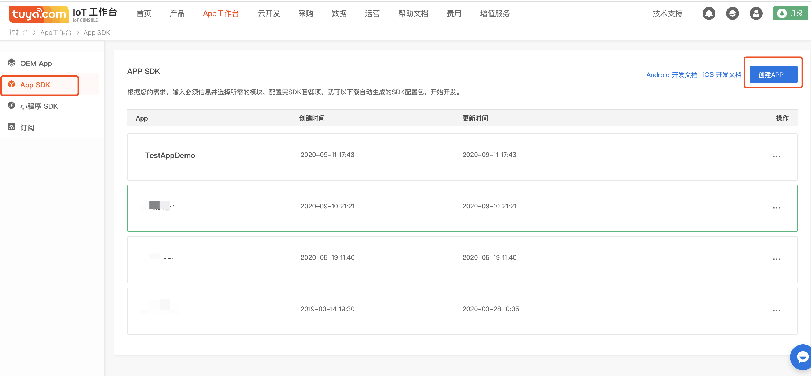
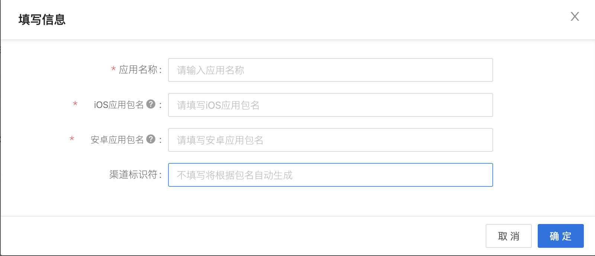
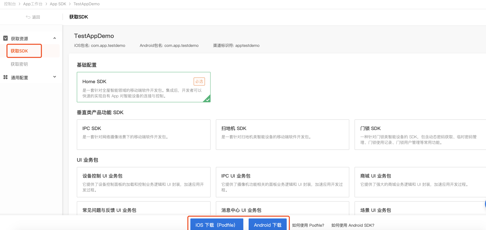
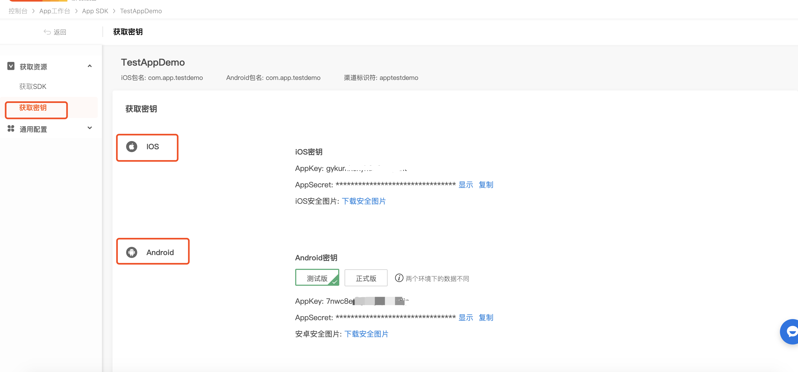

# Ready to work

## Register a developer account
Go to [Tuya Smart Development Platform](https://iot.tuya.com) to register a developer account, create a product, create a function point, etc. For the specific process, please refer to [Access Process](https://docs.tuya.com /zh/iot/device-intelligentize-in-5-minutes/device-intelligentize-in-5-minutes?id=K914joxbogkm6)

##  Create SDK application

Click "**App SDK**" in "**App Workbench**" in [Tuya IoT Platform](https://iot.tuya.com/), and click "**Create App**".

Fill in the App related information and click **Confirm**.

- **App name**: Fill in the name of your App.
- **iOS App Package Name**: Fill in your iOS App package name (recommended format: com.xxxxx.xxxxx).
- **Android App Package Name**: Fill in the name of your Android App package (the two can be consistent or inconsistent).
- **Channel Identifier**: It is not a required field. If it is not filled in, the system will automatically generate it according to the package name.

You can choose the option you need according to actual needs, support multiple selections, and then integrate the SDK according to Podfile and Gradle.

Click **Get Password** to get SDK AppKey, AppSecret, security picture and other information.

