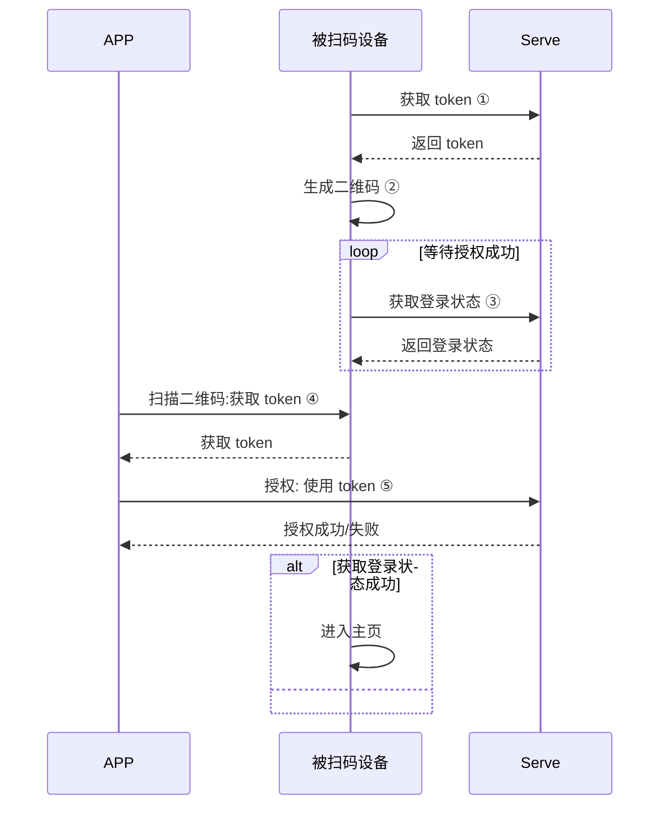
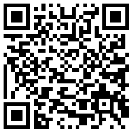

# User Management

User management mainly provides operations related to scanning, logging in, logging out, and obtaining user objects

| Class name | Description   |
| ----------- | ----------------- |
| ITuyaCommunityUser| Tuya community user management |


## QR code authorization login

> [!note]
>
> In the following process, the account system of **APP** and **Pad device** needs to be opened before they can be used, otherwise an error will be reported
>
> For example: if you use the "community" app to scan the QR code of the SDK created in the background, an error will be reported and the session will be invalid.
>
> If you don't know how to solve it, you need to contact the company's corresponding project manager.

## Flow Description

The QR code authorization login function is applicable to APP scan code to authorize another device to log in to the same account. The device can be Pad, central control device, TV, etc. The complete authorization process is as follows:


Explanation of the key steps marked in the figure:

### ①、Get token

The device request interface to obtain the token used in the authorization process, the interface is `getQRCodeToken`

### ②、Generate QR code

Use a specific format to generate a QR code with the obtained token:

The format is：`tuyaSmart--qrLogin?token=xxxxxxx`

E.g：

`tuyaSmart--qrLogin?token=AZc72de000-ec00-4000-9e51-b610fc300000`

After generating the QR code



Display the QR code generated by the above string on the screen of the device;

### ③、Get login status

Train the server to obtain whether the authorization is successful or not. If the authorization is successful, the user information will be returned, and the application homepage will be jumped to to enter the follow-up operation.

The interface is： `QRCodeLogin`

### ④、Scan QR code

The app scans the QR code on the device, parses the token in the QR code, and performs authorization operations

### ⑤、Authorization

Send the parsed QR code to the cloud to complete the authorization action.

The authorization interface is `QRcodeAuth`

## Interface Description

### Get the token interface

User gets token

**Interface Description**

```java
void getQRCodeToken(String countryCode, ITuyaCommunityResultCallback callback);
```

**Parameter Description**

| Parameter   | Description                   |
| ----------- | ----------------------------- |
| countryCode | Country code, for example: 86 |
| callback    | callback                      |

**Sample Code**

```java
TuyaCommunitySDK.getUserInstance().getQRCodeToken("86", new ITuyaCommunityResultCallback<String>() {
    @Override
    public void onSuccess(String token) {

    }

    @Override
    public void onError(String code, String error) {

    }
});
```

### Get login status interface

****Interface Description****

```Java
void QRCodeLogin(String countryCode, String token, ILoginCallback callback);
```

**Parameter Description**

| Parameter   | Description                   |
| ----------- | ----------------------------- |
| countryCode | Country code, for example: 86 |
| token       | token                         |
| callback    | callback                      |

**Sample Code**

```java
TuyaCommunitySDK.getUserInstance().deviceQRCodeLogin("86", "xxxx", new ITuyaCommunityResultCallback<CommunityUser>() {
    @Override
    public void onSuccess(User user) {
        if (user != null && !TextUtils.isEmpty(user.getSid())){
            gotoHomePage();
        }
    }

    @Override
    public void onError(String code, String error) {

    }
});
```

### Authorization interface

**Interface Description**

```java
void phoneQRTokenLogin(String countryCode, long homeId, String token, ITuyaCommunityCallback callback);
```

**Parameter Description**

| Parameter   | Description                                                  |
| ----------- | ------------------------------------------------------------ |
| countryCode | Country code, for example: 86                                |
| homeId      | House id. Please refer to the relevant chapters of the house to obtain |
| token       | token                                                        |
| callback    | callback                                                     |

**Sample Code**

```java
TuyaCommunitySDK.getUserInstance().phoneQRTokenLogin(countryCode, homeId, token, new ITuyaCommunityCallback() {
            @Override
            public void onError(String code, String error) {
                
            }

            @Override
            public void onSuccess() {

            }
        });
```
# User data model
User-related data model.

## CommunityUser
| Parameter     | Description                                              |
| ----------------- | ------------------------------------------------------------ |
| headPic           | User avatar link                                 |
| nickName          | User's Nickname                                      |
| username          | Username<br/>If the main account is a mobile phone number, username is the mobile phone number<br/>If the main account is an email address, username is the email address |
| mobile            | phone number                                           |
| email             | mailbox                                                  |
| phoneCode         | Country code<br/>For example:<br/>86: China<br/>1: United States |
| CommunityDomain.regionCode | The country and region where the current account is located. AY: China, AZ: United States, EU: Europe |
| timezoneId        | User time zone information, for example: `Asia/Shanghai` |
| tempUnit          | Temperature unit。1：`°C`， 2：`°F`                  |
| snsNickname       | The nickname of the third-party account      |
| regFrom           | Type of account registration<br/>0: Email<br/>1: Mobile<br/>2: Registration (other)<br/>3: qq<br/>5: facebook<br/>6: twitter<br/>7: weixin<br>9: uid<br>10: google<br> |

### Get user object

**Interface Description**

After logging in, the user object can be obtained from the cache

```java
CommunityUser getUser();
```

**Sample Code**

```java
TuyaCommunitySDK.getCommunityUserInstance().getUser();
```


# Sign out

**Interface Description**

```java
void logout(ITuyaCommunityCallback callback);
```

**Parameter Description**

| Parameter | Description |
| --------- | ----------- |
| callback  | callback    |

**Sample Code**

```java
TuyaCommunitySDK.getCommunityUserInstance().logout(new ITuyaCommunityCallback() {
            @Override
            public void onError(String s, String s1) {

            }

            @Override
            public void onSuccess() {

            }
        });```


```