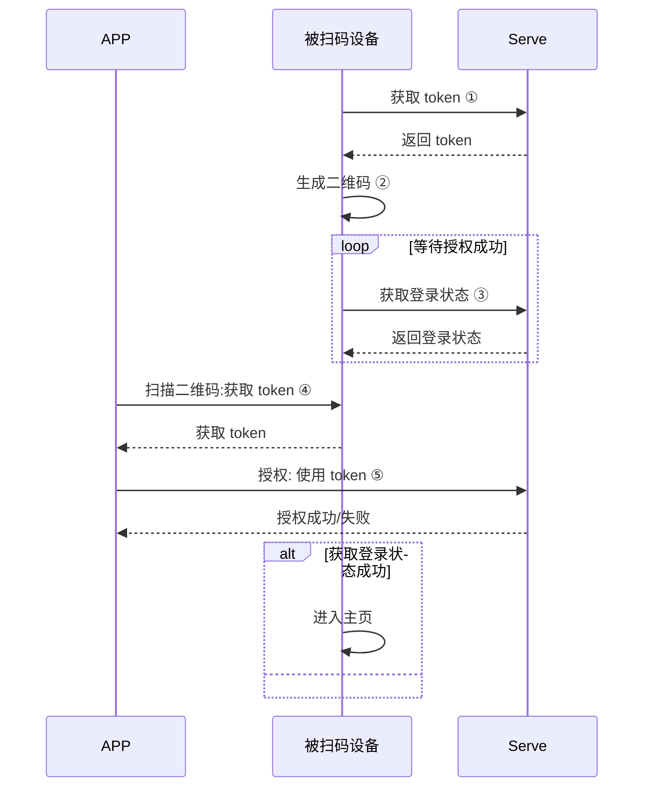

# 集成 SDK
## 创建工程

在 Android Studio 中新建工程。

## 配置 build.gradle 

build.gradle 文件里添加集成准备中下载的 dependencies 依赖库。

```groovy
defaultConfig {
    ndk {
        abiFilters "armeabi-v7a", "arm64-v8a"
    }
 }
dependencies {
    implementation 'com.alibaba:fastjson:1.1.67.android'
    implementation 'com.squareup.okhttp3:okhttp-urlconnection:3.14.9'
  	
    // Tuya CommunitySDK 最新稳定版：（名称暂定）
    implementation 'com.tuya.smart:tuyacommunity:0.0.1'
  
   
}
```

在根目录的 build.gradle 文件中增加 jcenter() 仓库

```groovy
repositories {
    jcenter()
}
```

>[!TIP]
>
> * 涂鸦社区已经将 armeabi-v7a、arm64-v8a 集成进 sdk。


## 集成安全图片

点击 "下载安全图片" ——"安全图片下载" 下载安全图片。


在集成准备中点击“下载安全图片”。将下载的安全图片命名为 “t_s.bmp”，放置到工程目录的 assets 文件夹下。


## 设置 Appkey 和 AppSecret

在 AndroidManifest.xml 文件里配置 appkey 和 appSecret，在配置相应的权限等

```xml
<meta-data
android:name="TUYA_SMART_APPKEY"
android:value="应用 Appkey" />
<meta-data
android:name="TUYA_SMART_SECRET"
android:value="应用密钥 AppSecret" />

```

## 混淆配置

在 proguard-rules.pro 文件配置相应混淆配置

```bash
#fastJson
-keep class com.alibaba.fastjson.**{*;}
-dontwarn com.alibaba.fastjson.**

#mqtt
-keep class com.tuya.smart.mqttclient.mqttv3.** { *; }
-dontwarn com.tuya.smart.mqttclient.mqttv3.**

#OkHttp3
-keep class okhttp3.** { *; }
-keep interface okhttp3.** { *; }
-dontwarn okhttp3.**

-keep class okio.** { *; }
-dontwarn okio.**

-keep class com.tuya.**{*;}
-dontwarn com.tuya.**
```

## 初始化 SDK
**描述**

用于初始化 SDK，请在 Application 中初始化 SDK，确保所有进程都能初始化。

**示例代码**

```java
public class TuyaCommunityApp extends Application {
    @Override
    public void onCreate() {
        super.onCreate();
        TuyaCommunitySDK.init(this);
    }
}
```


appId 和 appSecret 需要配置 AndroidManifest.xml 文件里，也可以在初始化代码里初始化。

```java
TuyaCommunitySDK.init(Application application, String appkey, String appSerect) 
```


## 注销涂鸦云连接
在退出应用的时候调用以下接口注销掉。

```java
TuyaCommunitySDK.onDestroy();
```

## 调试开关

在 debug 模式下可以开启 SDK 的日志开关，查看更多的日志信息，帮助快速定位问题。在 release 模式下建议关闭日志开关。

```java
TuyaCommunitySDK.setDebugMode(true);
```
# 二维码授权登录

> [!note]
>
> 以下流程中的 **APP** 和 **Pad 设备** 的账号体系需要打通才能使用，否则会报错
>
> 比如：如果你使用 "社区" app 来扫描后台创建的 SDK 的二维码那么会报错，session 失效。
>
> 如果不知道如何解决需要联系公司对应的项目经理。

## 流程说明

二维码授权登录功能适用于 APP 扫码授权另一台设备登录相同账号。设备可以是 Pad 、中控设备、TV  等。完整授权流程如下：


图中标注的关键步骤解释：

### ①、获取 token

设备请求接口获取授权流程使用的 token，接口为`getQRCodeToken`

### ②、生成二维码

将获取到的 token，使用特定格式生成二维码：

格式为：`tuyaSmart--qrLogin?token=xxxxxxx`

例如：

`tuyaSmart--qrLogin?token=AZc72de000-ec00-4000-9e51-b610fc300000`

生成二维码后


将上面字符串生成二维码展示在设备的屏幕中；

### ③、获取登录状态

向服务端轮训获取是否授权成功，如果授权成功后将返回用户信息，跳转进入应用主页，进入后续操作。

接口为： `QRCodeLogin`

### ④、扫描二维码

app 扫描设备上的二维码，将二维码中 token 解析出来，进行授权操作

### ⑤、授权

将解析出的二维码发送到云端，完成授权动作。

授权接口为`QRcodeAuth`

## 接口说明

### 获取 token 接口

用户获取 token

**接口说明**

```java
void getQRCodeToken(String countryCode, ITuyaCommunityResultCallback callback);
```

**参数说明**

| 参数        | 说明              |
| ----------- | ----------------- |
| countryCode | 国家区号,例如：86 |
| callback    | 回调              |

**示例代码**

```java
TuyaCommunitySDK.getUserInstance().getQRCodeToken("86", new ITuyaCommunityResultCallback<String>() {
    @Override
    public void onSuccess(String token) {

    }

    @Override
    public void onError(String code, String error) {

    }
});
```

### 获取登录状态接口

**接口说明**

```Java
void QRCodeLogin(String countryCode, String token, ILoginCallback callback);
```

**参数说明**

| 参数        | 说明              |
| ----------- | ----------------- |
| countryCode | 国家区号,例如：86 |
| token       | token             |
| callback    | 回调              |

**示例代码**

```java
TuyaCommunitySDK.getUserInstance().deviceQRCodeLogin("86", "xxxx", new ITuyaCommunityResultCallback<CommunityUser>() {
    @Override
    public void onSuccess(User user) {
        if (user != null && !TextUtils.isEmpty(user.getSid())){
            gotoHomePage();
        }
    }

    @Override
    public void onError(String code, String error) {

    }
});
```

### 授权接口

**接口说明**

```java
void phoneQRTokenLogin(String countryCode, long homeId, String token, IBooleanCallback callback);
```

**参数说明**

| 参数        | 说明                            |
| ----------- | ------------------------------- |
| countryCode | 国家区号,例如：86               |
| homeId      | 房屋 id。请参考房屋相关章节获取 |
| token       | token                           |
| callback    | 回调                            |

**示例代码**

```java
TuyaCommunitySDK.getUserInstance().phoneQRTokenLogin(countryCode, homeId, token, new ITuyaCommunityCallback() {
            @Override
            public void onError(String code, String error) {
                
            }

            @Override
            public void onSuccess() {

            }
        });
```

### 账号是否已经登录

**接口说明**

```java
boolean isLogin();
```


**示例代码**

```java
TuyaCommunitySDK.getUserInstance().phoneQRTokenLogin(countryCode, homeId, token, new ITuyaCommunityCallback() {
            @Override
            public void onError(String code, String error) {
                
            }

            @Override
            public void onSuccess() {

            }
        });
```


# 房屋

### 获取房屋列表接口

**接口说明**

```java
void getCommunityHomeList(ITuyaCommunityResultCallback<List<CommunityHomeBean>> callback);
```

**参数说明**

| 参数        | 说明                            |
| ----------- | ------------------------------- |
| callback    | 回调                            |

**示例代码**

```java
TuyaCommunitySDK.getHomeInstance().getCommunityHomeList(new ITuyaCommunityResultCallback<List<CommunityHomeBean>>() {
            @Override
            public void onSuccess(List<CommunityHomeBean> result) {
                mView.showCommunityHomeBean(result);
            }

            @Override
            public void onError(String errorCode, String errorMessage) {

            }
        });
```
### 获取房屋详情接口

**接口说明**

```java
void phoneQRTokenLogin(String countryCode, long homeId, String token, IBooleanCallback callback);
```

**参数说明**

| 参数        | 说明                            |
| ----------- | ------------------------------- |
| countryCode | 国家区号,例如：86               |
| homeId      | 房屋 id。请参考房屋相关章节获取 |
| token       | token                           |
| callback    | 回调                            |

**示例代码**

```java
TuyaCommunitySDK.getHomeInstance().getCommunityHomeDetail(homeId, new ITuyaCommunityResultCallback<CommunityHomeBean>() {
            @Override
            public void onSuccess(CommunityHomeBean result) {
                mView.showDetail(result);
            }

            @Override
            public void onError(String errorCode, String errorMessage) {

            }
        });
```

# 智家设备

涂鸦社区提供了丰富的接口供开发者实现设备信息的获取和管理能力(移除等)。设备相关的返回数据都采用异步消息的方式通知接收者。ITuyaDevice 类提供了设备状态通知能力，通过注册回调函数，开发者可以方便的获取设备数据接受、设备移除、设备上下线、手机网络变化的通知。同时也提供了控制指令下发，设备固件升级的接口

**DeviceBean 数据模型**


| 字段|类型|描述|
| :--| :--| :--|
| devId |String|设备唯一标示 id|
| name |String|设备名称|
| iconUrl |String|图标地址|
| getIsOnline |Boolean|设备是否在线（局域网或者云端在线）|
| schema |String|设备控制数据点的类型信息|
| productId |String|产品ID，同一个产品 ID，Schema 信息一致|
| supportGroup |Boolean|设备是否支持群组，如果不支持请到开放平台开启此项功能|
| time | Long |设备激活时间|
| pv | String |网关协议版本|
| bv | String |网关通用固件版本|
| schemaMap | Map |Schema 缓存数据|
| dps | Map |设备当前数据信息。key 是 dpId ，value 是值|
| isShare | boolean |是否是分享设备|
| virtual|boolean |是否是虚拟设备|
| lon、lat |String| 用来标示经纬度信息，需要用户使用 sdk 前，调用 TuyaSdk.setLatAndLong 设置经纬度信息 |
| isLocalOnline|boolean|设备局域网在线状态|
| nodeId |String|用于网关和子设备类型的设备，属于子设备的一个属性，标识其短地址 ID，一个网关下面的 nodeId 都唯一的|
| timezoneId |String|设备时区|
| category | String |设备类型|
| meshId |String|用于网关和子设备类型的设备，属于子设备的一个属性，标识其网关 ID|
| isZigBeeWifi |boolean|是否是 ZigBee 网关设备|
| hasZigBee |boolean|hasZigBee|


**注意事项**

设备控制如果需要使用经纬度，需要在配网前调用方法设置经纬度:

```java
TuyaSdk.setLatAndLong(String latitude, String longitude)
```

## 设备初始化
###  初始化房屋数据


设备控制必须先初始化数据，调用下面的方法获取房屋下的设备信息，每次APP存活期间初始化一次就可以了，此外切换房屋也需要进行初始化：

```java
TuyaCommunitySDK.newCommunityHomeInstance(homeId).getCommunityHomeDetail(new ITuyaCommunityResultCallback<CommunityHomeBean>()() {
    @Override
    public void onSuccess(CommunityHomeBean homeBean) {
    	
    }

    @Override
    public void onError(String errorCode, String errorMsg) {

    }
});
```

该接口的 onSuccess 方法中将返回`CommunityHomeBean `，然后调用 `CommunityHomeBean ` 的 `getDeviceList` 即可获得设备列表：

```java
List<DeviceBean> deviceList = homeBean.getDeviceList();
```

### 初始化设备控制

**接口说明**

根据设备 id 初始化设备控制类

```java
TuyaCommunitySDK.getCommunityDeviceManageInstance().newDeviceInstance(String devId);
```

**参数说明**

| 参数| 说明|
| ---- | --- |
| devId |设备 id|

**示例代码**

```java
ITuyaDevice mDevice = TuyaCommunitySDK.getCommunityDeviceManageInstance().newDeviceInstance(deviceBean.getDevId());
```

## 设备监听

### 注册设备监听
**接口说明**

ITuyaDevice 提供设备相关信息（ dp 数据、设备名称、设备在线状态和设备移除）的监听，会实时同步到这里。

```java
ITuyaDevice.registerDevListener(IDevListener listener)
```


**参数说明**

| 参数| 说明|
| ---- | --- |
| listener| 设备状态监听|

`IDevListener` 接口如下：

```java
public interface IDevListener {

    /**
     * dp数据更新
     *
     * @param devId 设备 id
     * @param dpStr 设备发生变动的功能点，为 json 字符串，数据格式：{"101": true}
     */
    void onDpUpdate(String devId, String dpStr);

    /**
     * 设备移除回调
     *
     * @param devId 设备id
     */
    void onRemoved(String devId);

    /**
     * 设备上下线回调
     *
     * @param devId  设备id
     * @param online 是否在线，在线为 true
     */
    void onStatusChanged(String devId, boolean online);

    /**
     * 网络状态发生变动时的回调
     *
     * @param devId  设备id
     *  @param status 网络状态是否可用，可用为 true
     */
    void onNetworkStatusChanged(String devId, boolean status);

    /**
     * 设备信息更新回调
     *
     * @param devId  设备 id
     */
    void onDevInfoUpdate(String devId);

}
```

其中，设备功能点说明见文档中的"[设备功能点说明](#设备功能点说明)"一节。

**示例代码**


```java
mDevice.registerDevListener(new IDevListener() {
    @Override
    public void onDpUpdate(String devId, String dpStr) {

    }
    @Override
    public void onRemoved(String devId) {

    }
    @Override
    public void onStatusChanged(String devId, boolean online) {

    }
    @Override
    public void onNetworkStatusChanged(String devId, boolean status) {

    }
    @Override
    public void onDevInfoUpdate(String devId) {

    }
});
```

### 取消设备监听

当不需要监听设备时，注销设备监听器。

**接口说明**

```java
ITuyaDevice.unRegisterDevListener()
```

**示例代码**


```java
mDevice.unRegisterDevListener();
```

## 设备控制

设备控制接口功能为向设备发送功能点，来改变设备状态或功能。

**接口说明**

设备控制支持三种通道控制，局域网控制，云端控制，和自动方式（如果局域网在线，先走局域网控制，局域网不在线，走云端控制）

* 局域网方式

  ```java
  ITuyaDevice.publishDps(dps, TYDevicePublishModeEnum.TYDevicePublishModeLocal, callback);
  ```

* 云端控制

  ```java
  ITuyaDevice.publishDps(dps, TYDevicePublishModeEnum.TYDevicePublishModeInternet, callback);
  ```

* 自动控制

  ```java
  ITuyaDevice.publishDps(dps, TYDevicePublishModeEnum.TYDevicePublishModeAuto, callback);
  ```

  或者

  ```java
  ITuyaDevice.publishDps(dps, callback);
  ```

推荐使用 `ITuyaDevice.publishDps(dps, callback)`

**参数说明**

| 参数| 说明|
| ---- | --- |
| dps | data points, 设备功能点，格式为 json 字符串|
| publishModeEnum | 设备控制方式|
| callback |发送控制指令是否成功的回调|

**示例代码**

假设开灯的设备功能点是 101，那么开灯的控制代码如下所示：
```java
mDevice.publishDps("{\"101\": true}", new IResultCallback() {
    @Override
    public void onError(String code, String error) {
        Toast.makeText(mContext, "开灯失败", Toast.LENGTH_SHORT).show();
    }
	
    @Override
    public void onSuccess() {
        Toast.makeText(mContext, "开灯成功", Toast.LENGTH_SHORT).show();
    }
});
```


> **[warning] 注意事项**
>
> * 指令下发成功并不是指设备真正操作成功，只是意味着指令成功发送出去。操作成功会有 dp 数据信息上报上来 ，且通过 `IDevListener onDpUpdate` 接口返回。
>
> * command 命令字符串 是以 `Map<String,Object>`(dpId 和 dpValue 键值对)数据格式转成 json 字符串。
>
> * command 命令可以一次发送多个 dp 数据。
>
> 	

## 设备功能点说明

DeviceBean 类 dps 属性定义了设备的状态，称作数据点（ dp 点）或功能点。`dps` 字典里的每个 `key` 对应一个功能点的 `dpId`，`dpValue` 为该功能点的值。各自产品功能点定义参见[涂鸦开发者平台](https://iot.tuya.com/index)的产品功能。
功能点具体参见[功能点相关概念](https://docs.tuya.com/zh/iot/configure-in-platform/function-definition/custom-functions#%E5%8A%9F%E8%83%BD%E7%82%B9%E7%9B%B8%E5%85%B3%E6%A6%82%E5%BF%B5)

**指令格式**

发送控制指令按照以下格式：
	{"(dpId)":"(dpValue)"}

**功能点示例**

开发平台可以看到一个产品这样的界面


根据后台该产品的功能点定义，示例代码如下:

```java
//设置 dpId 为 101 的布尔型功能点示例 作用:开关打开 
dps = {"101": true};

//设置 dpId 为 102 的字符串型功能点示例 作用:设置 RGB 颜色为 ff5500
dps = {"102": "ff5500"};

//设置dpId为103的枚举型功能点示例 作用:设置档位为2档
dps = {"103": "2"};

//设置 dpId 为 104 的数值型功能点示例 用:设置温度为 20°
dps = {"104": 20};

//设置 dpId 为 105 的透传型( byte 数组)功能点示例 作用:透传红外数据为 1122
dps = {"105": "1122"};

//多个功能合并发送
dps = {"101": true, "102": "ff5500"};

mDevice.publishDps(dps, new IResultCallback() {
        @Override
        public void onError(String code, String error) {
        //错误码11001
        //有下面几种情况：
        //1、类型不对导致，例如，string 类型格式，发成 boolean 类型数据。
        //2、只读类型 dp 数据不能下发，参考 SchemaBean getMode "ro" 是只读类型。
        //3、raw 格式发送数据格式不是 16 进制字符串。
        }
        @Override
        public void onSuccess() {
        }
    });
```

> **[warning] 注意事项**
>
> * 控制命令的发送需要特别注意数据类型.
>
> 	比如功能点的数据类型是数值型（ value ），那控制命令发送的应该是 `{"104": 25}`  而不是  `{"104": "25"}`
>
> * 透传类型传输的 byte 数组是 16 进制字符串格式并且必须是偶数位
>  比如正确的格式是: `{"105": "0110"}` 而不是 `{"105": "110"}`
> 
  

## 设备信息查询

**接口说明**

查询单个 dp 数据。

该接口并非同步接口，查询后的数据会通过 `IDevListener.onDpUpdate()` 接口回调。

```java
mDevice.getDp(String dpId, IResultCallback callback);
```

**示例代码**

```java
mDevice.getDp(dpId, new IResultCallback() {
    @Override
    public void onError(String code, String error) {

    }

    @Override
    public void onSuccess() {

    }
});
```


> **[warning] 注意事项**
>
> 该接口主要是针对那些数据不主动去上报的 dp 点，例如倒计时信息查询。 常规查询 dp 数据值可以通过 DeviceBean 里面 getDps() 去获取。

## 修改设备名称

**接口说明**

设备重命名，支持多设备同步。

```java
//重命名
mDevice.renameDevice(String name,IResultCallback callback);
```

**示例代码**

```java
mDevice.renameDevice("设备名称", new IResultCallback() {
    @Override
    public void onError(String code, String error) {
        //重命名失败
    }
    @Override
    public void onSuccess() {
        //重命名成功
    }
});
```

成功之后 ，`IDevListener.onDevInfoUpdate()` 会收到通知。

调用以下方法获取最新数据，然后刷新设备信息即可。

```java
TuyaCommunitySDK.getCommunityDataManager().getDeviceBean(String devId);
```

## 移除设备

**接口说明**

用于从用户设备列表中移除设备

```java
void removeDevice(IResultCallback callback);
```

**示例代码**

```java
mDevice.removeDevice(new IResultCallback() {
    @Override
    public void onError(String errorCode, String errorMsg) {
    }

    @Override
    public void onSuccess() {
    }
});
```

## 恢复出厂设置

**接口说明**

用于将设备重置，恢复到出厂状态，设备恢复出厂设置后，会重新进入待配网状态（快连模式），设备的相关数据会被清除掉。

```java
void resetFactory(IResultCallback callback)；
```

**示例代码**

```java
mDevice.resetFactory(new IResultCallback() {
    @Override
    public void onError(String errorCode, String errorMsg) {
    }

    @Override
    public void onSuccess() {
    }
});
```

## 查询 Wi-Fi 信号强度

获取当前设备 Wi-Fi 的信号强度

**接口说明**

```java
void requestWifiSignal(WifiSignalListener listener);
```

**示例代码**

```java
mDevice.requestWifiSignal(new WifiSignalListener() {
     
     @Override
     public void onSignalValueFind(String signal) {
      
     }
     
     @Override
     public void onError(String errorCode, String errorMsg) {

     }
 });;
```

## 回收设备资源
**接口说明**

应用或者 Activity 关闭时，可以调用此接口，回收设备占用的资源。

```java
void onDestroy()
```

**示例代码**

```java
mDevice.onDestroy();
```

# 智能场景

智能场景分为「一键执行场景」和「自动化场景」，下文分别简称为「一键执行」和「自动化」。

一键执行是用户添加动作，手动触发；自动化是由用户设定条件，当条件触发后自动执行设定的动作。

涂鸦云支持用户根据实际生活场景，通过设置气象或设备条件，当条件满足时，让一个或多个设备执行相应的任务。

| 场景管理 | 说明 |
| -------------- | ---------- |
|  TuyaCommunitySDK.newCommunitySceneInstance(sceneId)   |   提供了单个场景的执行操作，需要使用场景 id  进行初始化，场景 id 指的是 `CommunitySceneBean` 的 `id` 字段，可以从[获取场景列表接口](#GetSceneList)的返回结果中获取。 |
|TuyaCommunitySDK.getCommunitySceneManager()| 目前主要提供了场景列表数据获取。|


在使用智能场景相关的接口之前，需要首先了解场景条件和场景任务这两个概念。
## 场景条件

场景条件对应 `CommunitySceneCondition` 类，涂鸦云支持以下条件类型：

- 气象条件：包括温度、湿度、天气、PM2.5、空气质量、日落日出，用户选择气象条件时，可以选择当前城市。
- 设备条件：指用户可预先选择一个设备的功能状态，当该设备达到该状态时，会触发当前场景里的任务，但同一设备不能同时作为条件和任务，避免操作冲突。
- 定时条件：指可以按照指定的时间去执行预定的任务。

## 场景任务

场景任务是指当该场景满足已经设定的气象或设备条件时，让一个或多个设备执行某种操作，对应 `CommunitySceneTask` 类。或者关闭、开启一个自动化。

CommunitySceneTask的主要属性定义如下

|字段|类型| 描述 |
| ------ | ------ | ----------- |
| id | Sting | 动作 id 
| actionExecutor | String | 动作类型。枚举如下：<br>ruleTrigger：触发场景<br>ruleEnable：启用场景<br>ruleDisable：禁用场景<br>appPushTrigger：推送消息<br>mobileVoiceSend：电话服务<br>smsSend：短信服务<br>deviceGroupDpIssue：执行群组<br>irIssue：执行红外设备<br>dpIssue：执行普通设备<br>delay：延时<br>irIssueVii：执行红外设备（执行参数为真实红外控制码）<br>toggle：执行切换开关动作<br>dpStep：执行步进动作
| entityId | String | 设备 id
| entityName | String | 设备名称
| actionDisplayNew | Map&lt;String, List&lt;String&gt;&gt; | 动作展示信息
| executorProperty | Map&lt;String, Object&gt; | 动作执行信息
| extraProperty | Map&lt;String, Object&gt; | 动作额外信息

## 智能场景管理
### <span id="GetSceneList">场景列表功能</span>


**接口说明**


获取简单数据的场景列表数据。场景和自动化一起返回，通过条件 conditions 字段是否为空来区分场景和自动化。

```java
void getSceneList(long homeId,ITuyaCommunityResultCallback<List<CommunitySceneBean>> callback)
```
**参数说明**

| 参数 | 说明 |
| ----------- | ----------------------------------------------- |
| homeId | 智家房屋 id                           |                                   |
| callback    | 回调 |


其中，`CommunitySceneBean`的主要属性定义如下

|字段|类型| 描述 |
| ------ | ------ | ----------- |
| id |Sting| 场景 id 
| name |String| 场景名称 
| conditions | List&lt;SceneCondition&gt; | 场景条件列表
| actions | List&lt;SceneTask&gt; | 场景任务列表
| matchType | int | 满足条件的类型，满足任意条件为1，满足所有条件为2
| enable | boolean | 自动化是否启用


**示例代码**

```java
TuyaCommunitySDK.getCommunitySceneManager().getSceneList(long homeId, ITuyaCommunityResultCallback<List<CommunitySceneBean>>() {
    @Override
    public void onSuccess(List<CommunitySceneBean> result) {
    }

    @Override
    public void onError(String errorCode, String errorMessage) {
    }
});
```

### <span id="GetSceneDetail">获取场景详情数据</span>


**接口说明**


获取单个场景的详细数据，包含条件和动作的详细内容

```java
void getSceneDetail(long homeId,String sceneId, ITuyaCommunityResultCallback<CommunitySceneBean> callback)
```
**参数说明**

| 参数 | 说明 |
| ----------- | ----------------------------------------------- |
| homeId | 智家房屋 id                           |      
| sceneId | 场景id                           |                              
| callback    | 回调 |


**示例代码**

```java

TuyaCommunitySDK.getCommunitySceneManager().getSceneDetail(homeId, sceneId, new ITuyaCommunityResultCallback<CommunitySceneBean>() {
                @Override
                public void onSuccess(CommunitySceneBean communitySceneBean) {

                }

                @Override
                public void onError(String s, String s1) {

                }
            });
```            
 
## 单场景管理

### 执行一键执行

**接口说明**

注：这个方法只管发送指令到云端执行场景，具体设备执行成功与否，需要通过TuyaCommunitySDK.getCommunityDeviceManageInstance().newDeviceInstance(devId).registerDevListener() 监听设备的 dp 点变化。

```java
void executeScene(ITuyaCommunityCallback callback)
```
**参数说明**

|参数|说明|
| ------ | ----- |
| callback | 回调 |


**示例代码**

```java
String sceneId = sceneBean.getId();  
TuyaCommunitySDK.newCommunitySceneInstance(sceneId).executeScene(new ITuyaCommunityCallback() {
    @Override
    public void onSuccess() {
        Log.d(TAG, "Excute Scene Success");
    }

    @Override
    public void onError(String errorCode, String errorMessage) {
    }
});
```
### 开启关闭自动化场景（只有自动化场景才可以开启和失效）

**接口说明**

用于开启或关闭自动化场景

```java
void enableScene(String sceneId, final ITuyaCommunityCallback callback);

void disableScene(String sceneId, final ITuyaCommunityCallback callback);
```


**参数说明**

|参数|说明|
| ------ | ----- |
| sceneId |场景 id |
| callback | 回调 |

**示例代码**

```java
String sceneId = sceneBean.getId();  
TuyaCommunitySDK.newCommunitySceneInstance(sceneId).enableScene(sceneId,new 
ITuyaCommunityCallback() {
    @Override
    public void onSuccess() {
        Log.d(TAG, "enable Scene Success");
    }

    @Override
    public void onError(String errorCode, String errorMessage) {
    }
});

TuyaCommunitySDK.newCommunitySceneInstance(sceneId).disableScene(sceneId,new 
ITuyaCommunityCallback() {
    @Override
    public void onSuccess() {
        Log.d(TAG, "disable Scene Success");
    }

    @Override
    public void onError(String errorCode, String errorMessage) {
    }
});
```
            

# 推送
## 集成友盟

国内 Push 功能是基于友盟推送开发的，请先参考[友盟文档](https://developer.umeng.com/docs/66632/detail/66744)将友盟集成到项目中，涂鸦云支持友盟第三方通道，如果需要小米、华为、魅族通道，去各个平台申请，并且依照友盟文档初始化。

### 配置信息

将友盟申请方式可以参考文档[**友盟推送 Key 申请流程**](https://docs.tuya.com/docDetail?code=K8uhkjmak2nn8)

将申请到的 app key 等信息复制到 “APP 工作台”-“APP SDK”-对应应用的配置中，

> [!DANGER]  请勿将信息配置错误：
>
> * 确认友盟后台包名与 sdk 应用包名一致
> * Umeng Message Secret 和 App Master Secret 不要配置反了
> * 友盟后台 “启用服务器 IP 地址” 需要手动关闭


### 设置用户别名

在确保友盟已经集成到项目中后，通过友盟 SDK 设置用户 id，推送时会按照用户 id 向用户推送消息

```java
PushAgent mPushAgent = PushAgent.getInstance(this)
mPushAgent.setAlias(aliasId, ALIAS_TYPE, new UTrack.ICallBack() {
    @Override
    public void onMessage(boolean isSuccess, String message) {
    }
});
```

**参数说明**

| 参数       | 说明                                      |
| ---------- | ----------------------------------------- |
| aliasId    | 可以是你的应用为每个用户自动生成的唯一 id |
| ALIAS_TYPE | 需要填 "TUYA_SMART"                       |

### 注册涂鸦云 Push

将 aliasId 注册到涂鸦云，（必须！）

**参数说明**

| 参数         | 说明                                                         |
| ------------ | ------------------------------------------------------------ |
| aliasId      | 用户别名 将上一步中拿到的别名注册到涂鸦云，涂鸦云将会以该别名向 app 推送消息 |
| pushProvider | 注册 push 的类别 ，友盟需填写："umeng"                       |

**示例代码**

```java
 TuyaCommunitySDK.getCommunityPushInstance().registerDevice(String aliasId, String pushProvider, new IResultCallback() {
    @Override
    public void onError(String code, String error) {
    }

    @Override
    public void onSuccess() {

    }
});
```

### 第三方通道设置

如果使用了友盟第三方通道，弹窗的 activity 必须命名为 SpecialPushActivity.

以小米为例，SpecialPushActivity继承自 UmengNotifyClickActivity ，并且完整的包名路径为`com.activity.SpecialPushActivity`.

### Push消息接收

关于如何集成友盟自定义消息请参考友盟的接入文档 - 自定义消息（消息透传）部分

例如：

```java
UmengMessageHandler messageHandler = new UmengMessageHandler(){
    @Override
    public void dealWithCustomMessage(final Context context, final UMessage msg) {
        new Handler(getMainLooper()).post(new Runnable() {

            @Override
            public void run() { 
                Toast.makeText(context, msg.custom, Toast.LENGTH_LONG).show();
            }
        });
    }
};

mPushAgent.setMessageHandler(messageHandler);
```

>[!NOTE]  
> - msg.custom 中的内容就是收到的推送信息
> - msg.custom 的具体协议格式：
>	custom=tuya://message?a=view&ct="title"&cc="content"&p=>{}&link=tuyaSmart%3A%2F%2Fbrowser%3Furl%3Dhttp%253A%252F%252Fwww.baidu.com;
>- 通过 Uri uri = Uri.parse(message); 来对数据进行解析得到 需要的标题、内容、跳转信息等关键信息

### 用户解绑

**接口说明**

在用户退出登录等需要解除应用和用户关系的操作下调用友盟的移除别名的方法

```java
mPushAgent.deleteAlias(aliasId, "TUYA_SMART", new UTrack.ICallBack() {
    @Override
    public void onMessage(boolean isSuccess, String message) {
    }
});
```

**参数说明**

| 参数       | 说明                  |
| ---------- | --------------------- |
| aliasId    | 用户自动生成的唯一 id |
| ALIAS_TYPE | TUYA_SMART            |

### 发送 Push

#### 新增运营 Push

涂鸦开发者平台 - 用户运营 - 消息中心 - 新增消息


#### 新增告警 Push

涂鸦开发者平台 - 对应产品 - 扩展功能 - 告警设置 - 新增告警规则(应用推送方式)


## 消息推送设置

### 获取 APP 消息推送的开启状态

消息推送开关为总开关，关闭状态下无法接收到 设备告警、房屋消息、通知消息 等任何消息。

***接口说明***

```java
void getPushStatus(ITuyaCommunityResultCallback<CommunityPushStatusBean> callback);
```

**参数说明**

| 参数     | 说明                               |
| -------- | ---------------------------------- |
| callback | 回调，包括获取总开关状态成功和失败 |

**示例代码**

```java
 TuyaCommunitySDK.getCommunityPushInstance().getPushStatus(new ITuyaCommunityResultCallback<CommunityPushStatusBean>()  {
       @Override
       public void onSuccess(CommunityPushStatusBean result) {}
       @Override
       public void onError(String errorCode, String errorMessage) {}
 });
```


### 开启或者关闭APP消息推送

消息推送开关为总开关，关闭状态下无法接收到 设备告警、房屋消息、房屋通知消息 等任何消息

**接口说明**

```java
void setPushStatus(boolean isOpen, ITuyaCommunityResultCallback <Boolean> callback);
```

**参数说明**

| 参数     | 说明                     |
| -------- | ------------------------ |
| isOpen   | 是否开启                 |
| callback | 回调，包括设置成功和失败 |

**示例代码**

```java
TuyaCommunitySDK.getCommunityPushInstance().setPushStatus(isOpen, new ITuyaCommunityResultCallback<Boolean>() {
      @Override
      public void onSuccess(Boolean result) {}
      @Override
      public void onError(String errorCode, String errorMessage) {}
});
```

### 根据消息类型获取或设置消息的开关状态

#### 根据消息类型获取消息的开关状态

根据消息类型获取当前类型消息的开关状态

**接口说明**

```java
void getPushStatusByType(CommunityPushType type, ITuyaCommunityResultCallback <Boolean> callback);
```

**参数说明**

| 参数     | 说明                                                       |
| -------- | ---------------------------------------------------------- |
| type     | 消息类型（0-告警消息，1-房屋消息，2-通知消息，4-营销消息） |
| callback | 回调，包括获取成功和失败                                   |

**示例代码**

```java
TuyaCommunitySDK.getCommunityPushInstance().getPushStatusByType(type, new ITuyaCommunityResultCallback<Boolean>() {
      @Override
      public void onSuccess(Boolean result) {}
      @Override
      public void onError(String errorCode, String errorMessage) {}
});
```


#### 根据消息类型设置消息的开关状态

根据消息类型设置当前类型消息的开关状态。

**接口说明**

```java
void setPushStatusByType(CommunityPushType type, isOpen, ITuyaCommunityResultCallback <Boolean> callback);
```

**参数说明**

| 参数     | 说明                                                       |
| -------- | ---------------------------------------------------------- |
| type     | 消息类型（0-告警消息，1-房屋消息，2-通知消息，4-营销消息） |
| isOpen   | 是否开启                                                   |
| callback | 回调，包括设置成功和失败                                   |

**示例代码**

```java
TuyaCommunitySDK.getCommunityPushInstance().setPushStatusByType(type, isOpen, new ITuyaCommunityResultCallback<Boolean>()  {
      @Override
      public void onSuccess(Boolean result) {}
      @Override
      public void onError(String errorCode, String errorMessage) {}
});
```


#=========二期需求=========

# 物业

### 获取物业公告列表

**接口说明**

```java
void getPropertyAnnounceList(String communityId,String spaceTreeId,callback);
```

**参数说明**

| 参数        | 说明                            |
| ----------- | ------------------------------- |
| communityId      | 房屋社区 id。 |
| spaceTreeId       | 房间id                          |
| callback    | 回调                            |

**示例代码**

```java
TuyaCommunitySDK.getPropertyInstance().getPropertyAnnounceList(communityId, spaceTreeId, new ITuyaCommunityResultCallback<List<CommunityAnnounce>>() {
            @Override
            public void onSuccess(List<CommunityAnnounce> result) {
                mView.showDetail(result);
            }

            @Override
            public void onError(String errorCode, String errorMessage) {

            }
        });
```
### 进入物业详情页

**接口说明**

```java
 void gotoAnnouceDetailWeb(Context context,String url,String announcementId, String communityId)
```

**参数说明**

| 参数        | 说明                            |
| ----------- | ------------------------------- |
| url      | 路由地址 |
| announcementId       | 公告Id                         |
| communityId    | 社区Id                            |

**示例代码**

```java
TuyaCommunitySDK.getPropertyInstance().gotoAnnouceDetailWeb(context,url, announcementId, communityId); 
```

###  进入智能呼梯

**接口说明**

```java
 void gotoSmartCallWeb(Context context, String url, String projectId, String roomId);
```

**参数说明**

| 参数        | 说明                            |
| ----------- | ------------------------------- |
| url      | 路由地址 |
| projectId       | 项目Id                         |
| roomId    | 房间Id（同spaceTreeId）                            |

**示例代码**

```java
TuyaCommunitySDK.getSmartCallInstance().gotoSmartCallWeb(Context context, String url, String projectId, String roomId); 
```

### 获取可视对讲设备列表

**接口说明**

```java
 void getVisualSpeakDeviceList(String projectId, String roomId, callback);
```

**参数说明**

| 参数        | 说明                            |
| ----------- | ------------------------------- |
| callback      | 回调 |
| projectId       | 项目Id                         |
| roomId    | 房间Id（同spaceTreeId）                            |

**示例代码**

```java
TuyaCommunitySDK.getVisualSpeakInstance().getVisualSpeakDeviceList(String projectId, String roomId,new ITuyaCommunityResultCallback<ArrayList<VisualSpeakDeviceBean>> callback){
    @Override
            public void onFailure(BusinessResponse businessResponse, ArrayList<VisualSpeakDeviceBean> visualTalkDeviceBeans, String s) {
            }

            @Override
            public void onSuccess(BusinessResponse businessResponse, ArrayList<VisualSpeakDeviceBean> visualTalkDeviceBeans, String s) {
            }
}; 
```
