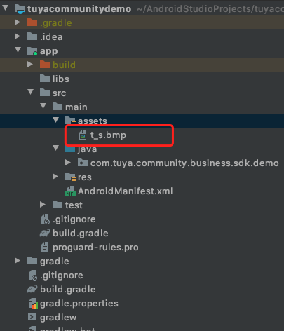
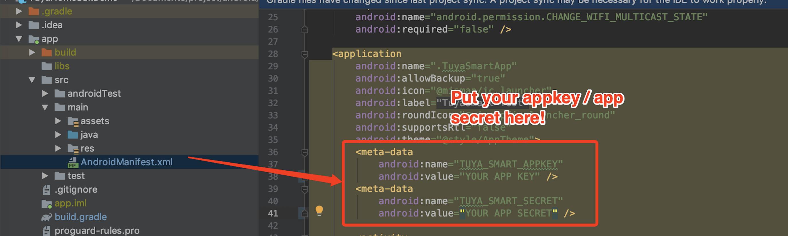

# Demo App

##  简介：

Demo APP 主要对 SDK 开发流程进行基本的演示。在开发 APP 之前，建议先按照本文档完成 Demo App 的操作。

在完成 [集成准备 ](Preparation.md)章节后，您将获取到 SDK 使用的 `AppKey`、 `AppSecret`、安全图片 信息。集成 SDK 时请确认 `AppKey`、`AppSecret`、安全图片是否与平台上的信息一致，任意一个不匹配会导致 SDK 无法使用。

[点击查看 Demo 地址🔗](https://github.com/TuyaInc/tuya_community_android_sdk)

1. 替换 app 目录下 `build.gradle` 文件中的 `applicationId` 为你的应用包名

2. 将你的安全图片命名为："t_s.bmp"，放到 app 目录下 "src" - "main" - "assets" 文件夹下 

3. 将你的 AppKey、AppSecret 填写到 `AndroidManifest.xml`中的对应<meta-data> 标签中


然后点击运行，运行你的 demo:

## 功能概述：

Demo App 主要包括了

- 用户管理：扫码登录相关
- 房屋管理和设备管理模块：包括房屋的列表和详情。房屋中中设备列表的展现，设备功能点的控制。设备重命名和设备移除。
- 场景模块：场景的列表，详情，执行等


## 常见问题

**API 接口请求提示签名错误**

```json
{
  "success" : false,
  "errorCode" : "SING_VALIDATE_FALED",
  "status" : "error",
  "errorMsg" : "Permission Verification Failed",
  "t" : 1583208740059
}
```

* 请检查 你的 AppKey 、AppSecret 和 安全图片是否正确配置，是否和 [集成准备 ](Preparation.md) 中获取到的一致。
* 安全图片是否放在正确目录，文件名是否为：t_s.bmp