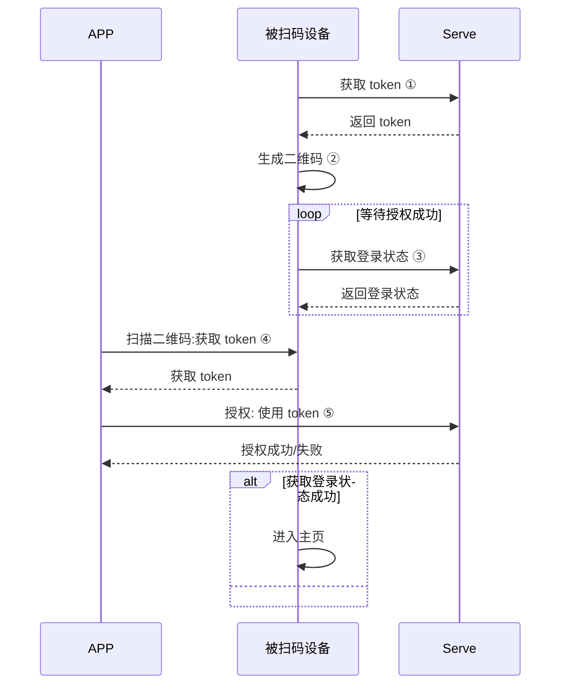

# 用户管理

用户管理主要提供了扫描登录相关接口和退出登录，以及用户对象获取等操作

| 类名        | 说明              |
| ----------- | ----------------- |
| ITuyaCommunityUser| 涂鸦社区用户管理类|


## 二维码授权登录

> [!note]
>
> 以下流程中的 **APP** 和 **Pad 设备** 的账号体系需要打通才能使用，否则会报错
>
> 比如：如果你使用 "社区" app 来扫描后台创建的 SDK 的二维码那么会报错，session 失效。
>
> 如果不知道如何解决需要联系公司对应的项目经理。

## 流程说明

二维码授权登录功能适用于 APP 扫码授权另一台设备登录相同账号。设备可以是 Pad 、中控设备、TV  等。完整授权流程如下：


图中标注的关键步骤解释：

### ①、获取 token

设备请求接口获取授权流程使用的 token，接口为`getQRCodeToken`

### ②、生成二维码

将获取到的 token，使用特定格式生成二维码：

格式为：`tuyaSmart--qrLogin?token=xxxxxxx`

例如：

`tuyaSmart--qrLogin?token=AZc72de000-ec00-4000-9e51-b610fc300000`

生成二维码后


将上面字符串生成二维码展示在设备的屏幕中；

### ③、获取登录状态

向服务端轮训获取是否授权成功，如果授权成功后将返回用户信息，跳转进入应用主页，进入后续操作。

接口为： `QRCodeLogin`

### ④、扫描二维码

app 扫描设备上的二维码，将二维码中 token 解析出来，进行授权操作

### ⑤、授权

将解析出的二维码发送到云端，完成授权动作。

授权接口为`QRcodeAuth`

## 接口说明

### 获取 token 接口

用户获取 token

**接口说明**

```java
void getQRCodeToken(String countryCode, ITuyaCommunityResultCallback callback);
```

**参数说明**

| 参数        | 说明              |
| ----------- | ----------------- |
| countryCode | 国家区号,例如：86 |
| callback    | 回调              |

**示例代码**

```java
TuyaCommunitySDK.getUserInstance().getQRCodeToken("86", new ITuyaCommunityResultCallback<String>() {
    @Override
    public void onSuccess(String token) {

    }

    @Override
    public void onError(String code, String error) {

    }
});
```

### 获取登录状态接口

**接口说明**

```Java
void QRCodeLogin(String countryCode, String token, ILoginCallback callback);
```

**参数说明**

| 参数        | 说明              |
| ----------- | ----------------- |
| countryCode | 国家区号,例如：86 |
| token       | token             |
| callback    | 回调              |

**示例代码**

```java
TuyaCommunitySDK.getUserInstance().deviceQRCodeLogin("86", "xxxx", new ITuyaCommunityResultCallback<CommunityUser>() {
    @Override
    public void onSuccess(User user) {
        if (user != null && !TextUtils.isEmpty(user.getSid())){
            gotoHomePage();
        }
    }

    @Override
    public void onError(String code, String error) {

    }
});
```

### 授权接口

**接口说明**

```java
void phoneQRTokenLogin(String countryCode, long homeId, String token, ITuyaCommunityCallback callback);
```

**参数说明**

| 参数        | 说明                            |
| ----------- | ------------------------------- |
| countryCode | 国家区号,例如：86               |
| homeId      | 房屋 id。请参考房屋相关章节获取 |
| token       | token                           |
| callback    | 回调                            |

**示例代码**

```java
TuyaCommunitySDK.getUserInstance().phoneQRTokenLogin(countryCode, homeId, token, new ITuyaCommunityCallback() {
            @Override
            public void onError(String code, String error) {
                
            }

            @Override
            public void onSuccess() {

            }
        });
```
# 用户数据模型
用户相关的数据模型。

## CommunityUser
| 字段              | 描述                                                         |
| ----------------- | ------------------------------------------------------------ |
| headPic           | 用户头像链接                                                 |
| nickName          | 用户昵称                                                     |
| username          | 用户名<br>如果主账号是手机号，username 就是手机号<br>如果主账号是邮箱，username 就是邮箱 |
| mobile            | 手机号                                                       |
| email             | 邮箱                                                         |
| phoneCode         | 国家码<br/>例如：<br/>86：中国<br/>1：美国                   |
| CommunityDomain.regionCode | 当前账号所在的国家区域。AY：中国，AZ：美国，EU：欧洲         |
| timezoneId        | 用户时区信息，例如： `Asia/Shanghai`                         |
| tempUnit          | 温度单位。1：`°C`， 2：`°F`                                  |
| snsNickname       | 第三方账号的昵称                                             |
| regFrom           | 账号注册的类型<br>0: 邮箱<br/>1: 手机<br/>2: 注册（其它）<br/>3: qq<br/>5: facebook<br/>6: twitter<br/>7: weixin<br>9: uid<br>10: google<br> |

### 获取用户对象

**接口说明**

登录之后可以从缓存中获取用户对象

```java
CommunityUser getUser();
```

**示例代码**

```java
TuyaCommunitySDK.getCommunityUserInstance().getUser();
```


# 退出登录

**接口说明**

```java
void logout(ITuyaCommunityCallback callback);
```

**参数说明**

| 参数        | 说明                            |
| ----------- | ------------------------------- |
| callback    | 回调                            |

**示例代码**

```java
TuyaCommunitySDK.getCommunityUserInstance().logout(new ITuyaCommunityCallback() {
            @Override
            public void onError(String s, String s1) {

            }

            @Override
            public void onSuccess() {

            }
        });```


